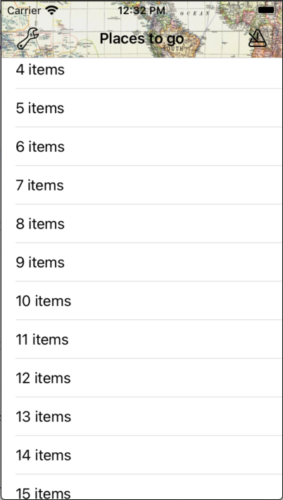
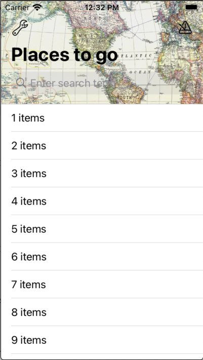
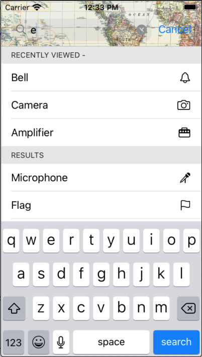

# SearchBarNavigation

A SwiftUI implementation of a UINavigationController with a search bar & search controller.
Currently only tried out on iOS, requires iOS 14 upwards.

Ignore the odd content of the example images, they're just to show how it works.

  

## Installation

### Swift Package Manager

In Xcode:
* File ⭢ Swift Packages ⭢ Add Package Dependency...
* Use the URL https://github.com/franklynw/SearchBarNavigation


## Example

> **NB:** All examples require `import SearchBarNavigation` at the top of the source file

This example is using a custom content type, so it can display icons as well as the search text (requires Combine as well) -

```swift
class MainViewModel: SearchBarShowing {
    
    typealias SearchListItemType = SearchItem
    
    private var subscriptions = Set<AnyCancellable>()
    
    @Published var searchResults: [SearchItemInfo] = [] // array of SearchListItemType.Content
    @Published var otherResults: [SearchItemInfo] = [] // array of SearchListItemType.Content
    @Published var selectedSearchTerm = ""
    
    private var _searchTerm: String = ""
    var searchTerm: Binding<String> {
        Binding<String>(
            get: { self._searchTerm },
            set: {
                
                self._searchTerm = $0
                
                if self._searchTerm.isEmpty {
                    self.searchResults = []
                    self.otherResults = []
                } else {
                    self.fetchSearchResults(using: self._searchTerm) {
                        self.searchResults = $0
                    }
                }
            }
        )
    }
    
    init() {
        
        $selectedSearchTerm
            .sink {
                print("Selected: ", $0)
            }
            .store(in: &subscriptions)
            
            otherResults = ...
    }
}


struct MainView: View {
    
    @ObservedObject private var viewModel: MainViewModel
    
    
    init(viewModel: MainViewModel) {
        self.viewModel = viewModel
    }
    
    var body: some View {
        
        SearchBarNavigation(viewModel) {
            // page content here
        }
        .navigationBarStyle(.withColorAndImage(textColor: .black, backgroundColor: Color(.myPaleMapColor), image: UIImage(named: "Map")!))
        .placeHolder("Search for somewhere")
    }
}

struct SearchItem: View, SearchBarListItem {
    
    private let content: SearchItemInfo
    private let textColor: Color
    
    init(parentViewModel: RecipesViewModel, content: SearchItemInfo, textColor: Color?, select: ((String) -> ())?) {
        self.content = content
        self.textColor = textColor ?? Color(.label)
    }
    
    var body: some View {
        HStack {
            Text(content.name)
                .foregroundColor(textColor)
            Spacer()
            Image(systemName: content.systemImageName)
        }
    }
}

struct SearchItemInfo {
    let name: String
    let systemImageName: String
    
    init(_ name: String, _ systemImageName: String) {
        self.name = name
        self.systemImageName = systemImageName
    }
    
    var searchTerm: String {
        return name
    }
}
```


Available modifiers -

### NavigationBar style

You can set the style attributes using a NavigationBarStyle value to customise things such as title colour & background colour or image.

```swift
SearchBarNavigation(viewModel)
    .navigationBarStyle(.colored(textColor: .purple, backgroundColor: .pink))
```

or 

```swift
SearchBarNavigation(viewModel)
    .navigationBarStyle(.withColorAndImage(textColor: .blue, backgroundColor: .yellow, image: myNavBarImage))
```

### Disable large titles

It defaults to using large titles, but you can disable that.

```swift
SearchBarNavigation(viewModel)
    .disableLargeTitles
```

### Translucent background

Set this so you can see the content below the navigation bar. Note that if you set a background colour for the title, unless that colour has an alpha component of less than 1, the bar will appear opaque.

```swift
SearchBarNavigation(viewModel)
    .translucentBackground
```

### Placeholder

You can set the search field's placeholder text.

```swift
SearchBarNavigation(viewModel)
    .placeHolder("Search for something")
```

### SearchScope titles

You can show a search scope control below the searchBar textField, which is configured with this modifier.

```swift
SearchBarNavigation(viewModel)
    .searchScopeTitles(["Title", "Keywords"])
```

### Bar buttons

You can set the bar buttons, either with normal buttons or with menu buttons (they show a menu when you tap them). This is controlled by the type of ButtonConfig you provide.

```swift
SearchBarNavigation(viewModel)
    .barButtons(viewModel.barButtons())
```

### SearchBar textField button

You can set the left view of the searchBar textField to a button.

```swift
SearchBarNavigation(viewModel)
    .searchFieldButton(someSearchFieldButton)
```

### SearchBar inputAccessoryView

You can show an inputAccessoryView above the keyboard, and configure it with various options using the SearchInputAccessory enum.

```swift
SearchBarNavigation(viewModel)
    .searchInputAccessory(someInputAccessory)
```

### The SearchView background colour

Set the background colour for the whole search results view.

```swift
SearchBarNavigation(viewModel)
    .searchViewBackgroundColor(Color(.lightGray))
```

### The search results headers colour

Set the colour of the headers for the results sections.

```swift
SearchBarNavigation(viewModel)
    .searchResultsHeadersColor(Color(.darkGray))
```

### The search results text colour

Set the colour of the text in the search results view.

```swift
SearchBarNavigation(viewModel)
    .searchResultsTextColor(Color(.darkText))
```

### Other Results section title

Sets the title of the other section of the results - if not used, will default to "Recents".

```swift
SearchBarNavigation(viewModel)
    .otherResultsSectionTitle("Recently viewed items -")
```

### Results section title

Sets the title of the "Results" section of the results - if not used, will default to "Results".

```swift
SearchBarNavigation(viewModel)
    .resultsSectionTitle("Search results -")
```

### Cancel button colour

The colour to use for the Cancel button - defaults to Color(.link) if unused.

```swift
SearchBarNavigation(viewModel)
    .cancelButtonColor(.red)
```

### Maximum number of other results

The maximum number of rows to show in the recents section - defaults to unlimited if unused.

```swift
SearchBarNavigation(viewModel)
    .maxOtherResults(5)
```

### Maximum number of search results

The maximum number of rows to show in the results section - defaults to unlimited if unused.

```swift
SearchBarNavigation(viewModel)
    .maxResults(5)
```

### Views to display in the event of no results

You can display custom views in the event of no results being returned.

```swift
SearchBarNavigation(viewModel)
    .resultsEmptyView {
        HStack(alignment: .bottom) {
            Image("EmptyGlass", bundle: nil)
            Text("We couldn't find anything to match your search")
                .font(.subheadline)
        }
        .background(Color.clear)
    }
```

or -

```swift
SearchBarNavigation(viewModel)
    .otherResultsEmptyView {
        HStack(alignment: .bottom) {
            Image("EmptyGlass", bundle: nil)
            Text("We couldn't find anything to match your search")
                .font(.subheadline)
        }
        .background(Color.clear)
    }
```

### Additional action if a search result item is selected

You can specify further actions to be invoked if an item is selected.

```swift
SearchBarNavigation(viewModel)
    .itemSelected { itemName in
        // do something
    }
```

### Show last results on activate

If you use this modifier, then previous results will be displayed before any new search is triggered

```swift
SearchBarNavigation(viewModel)
    .showLastResultsOnActivate
```

### Cancel search when tapping the keyboard dismiss button

When you tap the keyboard dismiss button in the inputAccessoryView (if configured), the default behaviour is to NOT cancel the search screen, but to leave all the results showing. You can override this behaviour with this modifier -

```swift
SearchBarNavigation(viewModel)
    .cancelSearchOnKeyboardDismiss
```


## NavigationBarStyle

An enum for configuring the navigation bar style. The options are -

* coloured - lets you specify text and background colours.

```swift
.colored(textColor: Color, backgroundColor: Color)
```

* withImage - lets you specify a background image for the navigation bar, plus text colour.

```swift
.withImage(textColor: Color, image: UIImage)
```

* withColorAndImage - lets you specify both a background colour and image (in the event of you having an image with an alpha channel), plus the text colour.

```swift
.withColorAndImage(textColor: Color, backgroundColor: Color, image: UIImage)
```


## BarButtons

This is the struct to use for configuring the navigation bar buttons. The initialiser allows you to specify leading & trailing buttons, and the button colour.

```swift
init(leading: [BarButton] = [], trailing: [BarButton] = [], color: Color? = nil)
```


## BarButton

The BarButton enum is for specifying the type of the button - a standard action button (using ImageButtonConfig) or a menu button (using BarMenuButton).


## BarMenuButton

Struct for configuring a menu button, using the FWMenu component. The initialisers require you to provide a closure which returns an array of FWMenuSection items, plus some other customisation options.


## SearchInputAccessory

This is the enum which allows you to configure an inputAccessoryView for the search bar. The options are -

* .buttons - you can specify an array of buttonConfigs for leading & trailing buttons, plus optional configuration for the keyboard dismiss button and the bar background colour.

```swift
.buttons(leading: [ImageButtonConfig] = [], trailing: [ImageButtonConfig] = [], keyboardDismissButtonConfig: ImageButtonConfig? = nil, backgroundColor: Color? = nil)
```

* .title - you can specify a title, plus optional configuration for the keyboard dismiss button and the bar background colour.

```swift
.title(FWMenuItem.Title, keyboardDismissButton: ImageButtonConfig? = nil, backgroundColor: Color? = nil)
```

* .textWithButton - you provide a text publisher which will update the description field in the bar (for instance, if the button you provide shows a menu which causes the description to change), and a buttonConfig, plus optional configuration for the keyboard dismiss button and the bar background colour.

```swift
.textWithButton(text: Published<String>.Publisher, buttonConfig: ImageButtonConfig, keyboardDismissButtonConfig: ImageButtonConfig? = nil, backgroundColor: Color? = nil)
```

# PlainNavigation

There is also a PlainNavigation view, which offers the same customisation options as SearchBarNavigation, minus the search stuff. This seems to work properly in a number of places where the Apple SwiftUI Navigation doesn't, plus it's easily customisable.


## Dependencies

* Requires FWMenu, which is linked. GitHub page is [here](https://github.com/franklynw/FWMenu)
* Requires ButtonConfig, which is linked. GitHub page is [here](https://github.com/franklynw/ButtonConfig)
* Requires FWCommonProtocols, which is linked. GitHub page is [here](https://github.com/franklynw/FWCommonProtocols)


## Issues

It all seems to work well, but there are probably still bugs... If anyone can suggest a better way of doing what I've done for the navBar background image (in NavigationConfiguring - setBackgroundImage) I'd really like to hear!


## Licence  

`SearchBarNavigation` is available under the MIT licence.
